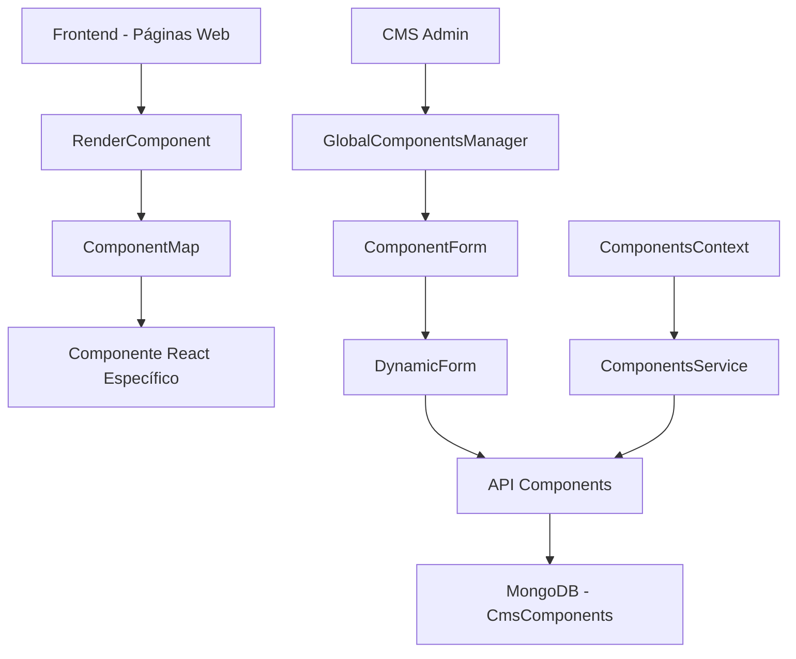

# Especificaciones y Requerimientos para Componentes CMS Editables

## 📋 Índice

1. [Introducción](#introducción)
2. [Arquitectura del Sistema](#arquitectura-del-sistema)
3. [Estructura de un Componente CMS](#estructura-de-un-componente-cms)
4. [Tipos de Componentes Disponibles](#tipos-de-componentes-disponibles)
5. [Proceso de Creación de Nuevos Componentes](#proceso-de-creación-de-nuevos-componentes)
6. [Sistema de Edición Dinámica](#sistema-de-edición-dinámica)
7. [Estructura de Datos](#estructura-de-datos)
8. [API y Endpoints](#api-y-endpoints)
9. [Formularios de Edición](#formularios-de-edición)
10. [Mejores Prácticas](#mejores-prácticas)
11. [Ejemplos Prácticos](#ejemplos-prácticos)

---

## 🎯 Introducción

El sistema de **Componentes CMS** permite crear, editar y gestionar componentes dinámicos que pueden ser utilizados en diferentes páginas del sitio web. Cada componente es completamente editable a través de formularios dinámicos que se generan automáticamente basándose en la estructura de datos del componente.

### Características Principales

- ✅ **Multi-tenant**: Cada cliente tiene sus propios componentes
- ✅ **Edición dinámica**: Formularios generados automáticamente
- ✅ **Tipos flexibles**: Soporte para texto, imágenes, iconos, enlaces y listas
- ✅ **Renderizado dinámico**: Los componentes se renderizan automáticamente
- ✅ **Gestión de medios**: Integración con el sistema de medios del CMS
- ✅ **Versionado**: Control de estados (draft/published)

---

## 🏗️ Arquitectura del Sistema



### Componentes Clave

1. **RenderComponent**: Renderiza componentes dinámicamente
2. **ComponentForm**: Formulario para crear/editar componentes
3. **DynamicForm**: Genera formularios basados en la estructura de datos
4. **GlobalComponentsManager**: Interfaz de administración
5. **ComponentsService**: Servicio para operaciones CRUD
6. **ComponentsContext**: Contexto React para gestión de estado

---

## 📦 Estructura de un Componente CMS

### Modelo de Base de Datos

```javascript
const CmsComponentSchema = {
  client: ObjectId, // Cliente propietario (multi-tenant)
  name: String, // Nombre descriptivo
  key: String, // Identificador único (slug)
  description: String, // Descripción opcional
  type: String, // Tipo de componente
  page: String, // Página donde se usa
  componentPath: String, // Ruta del componente React
  data: Mixed, // Datos del componente (JSON)
  mediaDependencies: [ObjectId], // Referencias a archivos de media
  isVisible: Boolean, // Visibilidad
  isActive: Boolean, // Estado activo
  category: String, // Categoría opcional
  updatedBy: ObjectId, // Usuario que actualizó
  timestamps: true, // createdAt, updatedAt
};
```

### Estructura TypeScript

```typescript
interface ComponentData {
  _id: string;
  name: string;
  key: string;
  page: string;
  type?: string;
  componentPath: string;
  data: Record<string, unknown>;
  description?: string;
  isVisible?: boolean;
  isActive?: boolean;
  client?: string;
  updatedBy?: string;
  createdAt: string;
  updatedAt: string;
  status?: "draft" | "published";
}
```

---

## 🎨 Tipos de Componentes Disponibles

### Componentes Predefinidos

| Tipo           | Nombre                  | Descripción                          | Icono            |
| -------------- | ----------------------- | ------------------------------------ | ---------------- |
| `hero_banner`  | Banner Hero             | Banner principal con imagen de fondo | FaImage          |
| `banner_demo`  | Banner Demo             | Banner promocional                   | FaBullhorn       |
| `contact_info` | Información de Contacto | Datos de contacto                    | FaPhone          |
| `cta_demo`     | Call to Action          | Botón de llamada a la acción         | FaHandPointUp    |
| `testimonials` | Testimonios             | Testimonios de clientes              | FaQuoteLeft      |
| `features`     | Características         | Lista de características             | FaStar           |
| `pricing`      | Precios                 | Tabla de precios                     | FaDollarSign     |
| `team`         | Equipo                  | Información del equipo               | FaUsers          |
| `gallery`      | Galería                 | Galería de imágenes                  | FaImages         |
| `faq`          | Preguntas Frecuentes    | FAQ                                  | FaQuestionCircle |
| `newsletter`   | Newsletter              | Suscripción a newsletter             | FaEnvelope       |
| `social_media` | Redes Sociales          | Enlaces a redes sociales             | FaShare          |
| `custom`       | Personalizado           | Componente personalizado             | FaCog            |

### Páginas Disponibles

- `home` - Inicio
- `about` - Acerca de
- `services` - Servicios
- `products` - Productos
- `contact` - Contacto
- `blog` - Blog
- `portfolio` - Portafolio
- `team` - Equipo
- `pricing` - Precios
- `faq` - FAQ

---

## 🔧 Proceso de Creación de Nuevos Componentes

### 1. Crear el Componente React

```typescript
// src/app/cms-components/[page]/MiNuevoComponente.tsx
import React from "react";
import IconRender from "@/components/common/IconRender";

interface MiNuevoComponenteContent {
  txt_titulo?: string;
  txt_descripcion?: string;
  img_principal?: string;
  btn_cta?: {
    label: string;
    url: string;
    icon?: string;
  };
  lista_items?: Array<{
    icon?: string;
    text: string;
    description?: string;
  }>;
}

interface MiNuevoComponenteProps {
  content?: MiNuevoComponenteContent;
}

const MiNuevoComponente: React.FC<MiNuevoComponenteProps> = ({ content }) => {
  if (!content) return null;

  const {
    txt_titulo,
    txt_descripcion,
    img_principal,
    btn_cta,
    lista_items = [],
  } = content;

  return (
    <section className="py-16 bg-gray-50">
      <div className="container mx-auto px-4">
        {txt_titulo && (
          <h2 className="text-3xl font-bold text-center mb-8">{txt_titulo}</h2>
        )}

        {txt_descripcion && (
          <p className="text-lg text-center mb-12 text-gray-600">
            {txt_descripcion}
          </p>
        )}

        {img_principal && (
          <div className="mb-8">
            
          </div>
        )}

        {lista_items.length > 0 && (
          <div className="grid grid-cols-1 md:grid-cols-3 gap-6 mb-8">
            {lista_items.map((item, index) => (
              <div
                key={index}
                className="text-center p-6 bg-white rounded-lg shadow"
              >
                {item.icon && (
                  <div className="mb-4">
                    <IconRender
                      icon={item.icon}
                      className="w-12 h-12 mx-auto text-blue-600"
                    />
                  </div>
                )}
                <h3 className="text-xl font-semibold mb-2">{item.text}</h3>
                {item.description && (
                  <p className="text-gray-600">{item.description}</p>
                )}
              </div>
            ))}
          </div>
        )}

        {btn_cta && (
          <div className="text-center">
            <a
              href={btn_cta.url}
              className="inline-flex items-center px-6 py-3 bg-blue-600 text-white font-semibold rounded-lg hover:bg-blue-700 transition-colors"
            >
              {btn_cta.icon && (
                <IconRender icon={btn_cta.icon} className="w-5 h-5 mr-2" />
              )}
              {btn_cta.label}
            </a>
          </div>
        )}
      </div>
    </section>
  );
};

export default MiNuevoComponente;
```

### 2. Registrar en el ComponentMap

```typescript
// src/components/common/RenderComponent.tsx
import MiNuevoComponente from "@/app/cms-components/home/MiNuevoComponente";

const componentMap = {
  hero_banner: HeroBanner,
  banner_demo: BannerDemo,
  contact_info: ContactInfo,
  mi_nuevo_componente: MiNuevoComponente, // ← Agregar aquí
  // ... otros componentes
};
```

### 3. Agregar al Array de Tipos

```typescript
// src/components/admin/ComponentForm.tsx
const COMPONENT_TYPES = [
  // ... tipos existentes
  { key: "mi_nuevo_componente", name: "Mi Nuevo Componente", icon: "FaRocket" },
];
```

### 4. Crear Datos de Ejemplo

```json
{
  "txt_titulo": "Mi Nuevo Componente",
  "txt_descripcion": "Descripción del componente",
  "img_principal": "/images/ejemplo.jpg",
  "btn_cta": {
    "label": "Llamada a la Acción",
    "url": "/contacto",
    "icon": "FaArrowRight"
  },
  "lista_items": [
    {
      "icon": "FaCheck",
      "text": "Característica 1",
      "description": "Descripción de la característica"
    },
    {
      "icon": "FaStar",
      "text": "Característica 2",
      "description": "Descripción de la característica"
    }
  ]
}
```

---

## ⚙️ Sistema de Edición Dinámica

### DynamicForm - Generación Automática

El sistema `DynamicForm` genera automáticamente formularios basándose en la estructura de datos del componente:

#### Tipos de Campo Soportados

| Prefijo  | Tipo   | Descripción                 | Ejemplo          |
| -------- | ------ | --------------------------- | ---------------- |
| `txt_`   | Texto  | Campo de texto simple       | `txt_titulo`     |
| `img_`   | Imagen | Selector de imagen          | `img_principal`  |
| `icon_`  | Icono  | Selector de icono           | `icon_principal` |
| `btn_`   | Botón  | Objeto con label, url, icon | `btn_cta`        |
| `link_`  | Enlace | Objeto con label y url      | `link_externo`   |
| `lista_` | Lista  | Array de elementos          | `lista_items`    |
| `item_`  | Item   | Elemento de lista           | `item_lista`     |

#### Ejemplo de Estructura de Datos

```json
{
  "txt_titulo": "Título Principal",
  "txt_subtitulo": "Subtítulo descriptivo",
  "img_hero": "/images/hero.jpg",
  "icon_principal": "FaRocket",
  "btn_cta": {
    "label": "Contactar",
    "url": "/contacto",
    "icon": "FaPhone"
  },
  "lista_servicios": [
    {
      "icon": "FaCode",
      "text": "Desarrollo Web",
      "description": "Creamos sitios web modernos"
    },
    {
      "icon": "FaMobile",
      "text": "Apps Móviles",
      "description": "Aplicaciones nativas e híbridas"
    }
  ]
}
```

### Formulario Generado Automáticamente

El `DynamicForm` creará automáticamente:

- ✅ **Campo de texto** para `txt_titulo`
- ✅ **Campo de texto** para `txt_subtitulo`
- ✅ **Selector de imagen** para `img_hero`
- ✅ **Selector de icono** para `icon_principal`
- ✅ **Grupo de campos** para `btn_cta` (label, url, icon)
- ✅ **Lista editable** para `lista_servicios` con campos anidados

---

## 📊 Estructura de Datos

### Convenciones de Nomenclatura

#### Campos de Texto

```typescript
txt_[nombre]: string
// Ejemplos:
txt_titulo: "Mi Título"
txt_descripcion: "Descripción del componente"
txt_subtitulo: "Subtítulo"
```

#### Campos de Imagen

```typescript
img_[nombre]: string  // URL de la imagen
// Ejemplos:
img_principal: "/images/hero.jpg"
img_logo: "/images/logo.png"
img_fondo: "/images/background.jpg"
```

#### Campos de Icono

```typescript
icon_[nombre]: string  // Nombre del icono (React Icons)
// Ejemplos:
icon_principal: "FaRocket"
icon_check: "FaCheck"
icon_star: "FaStar"
```

#### Campos de Botón/Enlace

```typescript
btn_[nombre]: {
  label: string;
  url: string;
  icon?: string;
}
// Ejemplo:
btn_cta: {
  label: "Contactar Ahora",
  url: "/contacto",
  icon: "FaPhone"
}
```

#### Listas de Elementos

```typescript
lista_[nombre]: Array<{
  [key: string]: any;
}>
// Ejemplo:
lista_servicios: [
  {
    icon: "FaCode",
    text: "Desarrollo Web",
    description: "Sitios web modernos"
  }
]
```

---

## 🔌 API y Endpoints

### Endpoints Principales

| Método | Endpoint                   | Descripción           |
| ------ | -------------------------- | --------------------- |
| GET    | `/api/cms-components`      | Listar componentes    |
| POST   | `/api/cms-components`      | Crear componente      |
| GET    | `/api/cms-components/[id]` | Obtener componente    |
| PUT    | `/api/cms-components/[id]` | Actualizar componente |
| DELETE | `/api/cms-components/[id]` | Eliminar componente   |

### Estructura de Request/Response

#### Crear Componente (POST)

```json
{
  "name": "Mi Banner Hero",
  "key": "hero_banner_home",
  "page": "home",
  "type": "hero_banner",
  "componentPath": "/app/cms-components/home/HeroBanner",
  "description": "Banner principal de la página de inicio",
  "data": {
    "txt_titulo": "Bienvenido a nuestro sitio",
    "txt_subtitulo": "La mejor solución para tu negocio",
    "img_principal": "/images/hero.jpg"
  },
  "isVisible": true,
  "isActive": true
}
```

#### Response

```json
{
  "success": true,
  "data": {
    "_id": "64f8a1b2c3d4e5f6a7b8c9d0",
    "name": "Mi Banner Hero",
    "key": "hero_banner_home",
    "page": "home",
    "type": "hero_banner",
    "componentPath": "/app/cms-components/home/HeroBanner",
    "data": {
      /* ... */
    },
    "client": "64f8a1b2c3d4e5f6a7b8c9d1",
    "createdAt": "2023-09-06T10:30:00.000Z",
    "updatedAt": "2023-09-06T10:30:00.000Z"
  }
}
```

---

## 📝 Formularios de Edición

### ComponentForm - Formulario Principal

El `ComponentForm` maneja la creación y edición de componentes:

#### Campos del Formulario

1. **Información Básica**

   - Nombre del componente
   - Clave única (auto-generada)
   - Descripción

2. **Configuración**

   - Página de destino
   - Tipo de componente
   - Ruta del componente (auto-generada)

3. **Estado**

   - Visible (isVisible)
   - Activo (isActive)

4. **Datos JSON**
   - Editor JSON para datos del componente
   - Validación de sintaxis

### DynamicForm - Editor de Contenido

El `DynamicForm` genera automáticamente campos basándose en la estructura de datos:

#### Tipos de Campo Generados

```typescript
// Texto simple
<input type="text" />

// Área de texto
<textarea />

// Selector de imagen
<ImagePicker onSelect={handleImageSelect} />

// Selector de icono
<IconSelector onSelect={handleIconSelect} />

// Grupo de campos para botones
<div>
  <input placeholder="Texto del botón" />
  <input placeholder="URL" />
  <IconSelector placeholder="Icono" />
</div>

// Lista editable
<div>
  {items.map(item => (
    <div key={item.id}>
      {/* Campos del item */}
    </div>
  ))}
  <button onClick={addItem}>Agregar Item</button>
</div>
```

---

## ✅ Mejores Prácticas

### 1. Nomenclatura de Componentes

```typescript
// ✅ CORRECTO
const HeroBanner: React.FC<HeroBannerProps> = ({ content }) => {
  // ...
};

// ❌ INCORRECTO
const hero_banner = (props) => {
  // ...
};
```

### 2. Estructura de Props

```typescript
// ✅ CORRECTO - Interface específica
interface HeroBannerContent {
  txt_titulo?: string;
  txt_subtitulo?: string;
  img_principal?: string;
}

interface HeroBannerProps {
  content?: HeroBannerContent;
}

// ❌ INCORRECTO - Props genéricas
interface Props {
  data: any;
}
```

### 3. Manejo de Datos Faltantes

```typescript
// ✅ CORRECTO - Validación y fallbacks
const HeroBanner: React.FC<HeroBannerProps> = ({ content }) => {
  if (!content) return null;

  const { txt_titulo = "Título por defecto", img_principal } = content;

  return (
    <section>
      <h1>{txt_titulo}</h1>
      {img_principal && }
    </section>
  );
};
```

### 4. Estilos Responsivos

```typescript
// ✅ CORRECTO - Clases responsivas
<div className="grid grid-cols-1 md:grid-cols-2 lg:grid-cols-3 gap-6">
  {/* Contenido */}
</div>

// ✅ CORRECTO - Breakpoints consistentes
<h1 className="text-2xl md:text-3xl lg:text-4xl font-bold">
  {titulo}
</h1>
```

### 5. Accesibilidad

```typescript
// ✅ CORRECTO - Alt text y ARIA labels


<button
  aria-label={`Abrir ${titulo}`}
  className="btn-primary"
>
  {icono && <IconRender icon={icono} />}
  {texto}
</button>
```

---

## 🎯 Ejemplos Prácticos

### Ejemplo 1: Componente de Testimonios

#### 1. Crear el Componente

```typescript
// src/app/cms-components/home/Testimonials.tsx
import React from "react";
import IconRender from "@/components/common/IconRender";

interface Testimonio {
  txt_nombre: string;
  txt_cargo?: string;
  txt_empresa?: string;
  txt_testimonio: string;
  img_avatar?: string;
  rating?: number;
}

interface TestimonialsContent {
  txt_titulo?: string;
  txt_subtitulo?: string;
  lista_testimonios?: Testimonio[];
}

interface TestimonialsProps {
  content?: TestimonialsContent;
}

const Testimonials: React.FC<TestimonialsProps> = ({ content }) => {
  if (!content) return null;

  const {
    txt_titulo = "Lo que dicen nuestros clientes",
    txt_subtitulo,
    lista_testimonios = [],
  } = content;

  return (
    <section className="py-16 bg-gray-50">
      <div className="container mx-auto px-4">
        <div className="text-center mb-12">
          <h2 className="text-3xl font-bold mb-4">{txt_titulo}</h2>
          {txt_subtitulo && (
            <p className="text-lg text-gray-600">{txt_subtitulo}</p>
          )}
        </div>

        <div className="grid grid-cols-1 md:grid-cols-2 lg:grid-cols-3 gap-8">
          {lista_testimonios.map((testimonio, index) => (
            <div key={index} className="bg-white p-6 rounded-lg shadow-lg">
              {/* Rating */}
              {testimonio.rating && (
                <div className="flex mb-4">
                  {[...Array(5)].map((_, i) => (
                    <IconRender
                      key={i}
                      icon="FaStar"
                      className={`w-5 h-5 ${
                        i < testimonio.rating!
                          ? "text-yellow-400"
                          : "text-gray-300"
                      }`}
                    />
                  ))}
                </div>
              )}

              {/* Testimonio */}
              <blockquote className="text-gray-700 mb-6">
                "{testimonio.txt_testimonio}"
              </blockquote>

              {/* Autor */}
              <div className="flex items-center">
                {testimonio.img_avatar && (
                  
                )}
                <div>
                  <div className="font-semibold">{testimonio.txt_nombre}</div>
                  {testimonio.txt_cargo && (
                    <div className="text-sm text-gray-600">
                      {testimonio.txt_cargo}
                      {testimonio.txt_empresa &&
                        ` en ${testimonio.txt_empresa}`}
                    </div>
                  )}
                </div>
              </div>
            </div>
          ))}
        </div>
      </div>
    </section>
  );
};

export default Testimonials;
```

#### 2. Datos de Ejemplo

```json
{
  "txt_titulo": "Lo que dicen nuestros clientes",
  "txt_subtitulo": "Testimonios reales de empresas que confían en nosotros",
  "lista_testimonios": [
    {
      "txt_nombre": "María González",
      "txt_cargo": "CEO",
      "txt_empresa": "TechCorp",
      "txt_testimonio": "Excelente servicio, superaron nuestras expectativas en todos los aspectos.",
      "img_avatar": "/images/testimonios/maria.jpg",
      "rating": 5
    },
    {
      "txt_nombre": "Carlos Rodríguez",
      "txt_cargo": "Director de Marketing",
      "txt_empresa": "InnovateLab",
      "txt_testimonio": "Profesionales altamente capacitados, entrega a tiempo y calidad excepcional.",
      "img_avatar": "/images/testimonios/carlos.jpg",
      "rating": 5
    }
  ]
}
```

### Ejemplo 2: Componente de Precios

#### 1. Crear el Componente

```typescript
// src/app/cms-components/pricing/PricingTable.tsx
import React from "react";
import IconRender from "@/components/common/IconRender";

interface Plan {
  txt_nombre: string;
  txt_precio: string;
  txt_periodo?: string;
  txt_descripcion?: string;
  lista_caracteristicas: string[];
  btn_cta: {
    label: string;
    url: string;
    icon?: string;
  };
  destacado?: boolean;
}

interface PricingTableContent {
  txt_titulo?: string;
  txt_subtitulo?: string;
  lista_planes?: Plan[];
}

interface PricingTableProps {
  content?: PricingTableContent;
}

const PricingTable: React.FC<PricingTableProps> = ({ content }) => {
  if (!content) return null;

  const {
    txt_titulo = "Nuestros Planes",
    txt_subtitulo,
    lista_planes = [],
  } = content;

  return (
    <section className="py-16">
      <div className="container mx-auto px-4">
        <div className="text-center mb-12">
          <h2 className="text-3xl font-bold mb-4">{txt_titulo}</h2>
          {txt_subtitulo && (
            <p className="text-lg text-gray-600">{txt_subtitulo}</p>
          )}
        </div>

        <div className="grid grid-cols-1 md:grid-cols-3 gap-8">
          {lista_planes.map((plan, index) => (
            <div
              key={index}
              className={`relative p-8 rounded-lg border-2 ${
                plan.destacado
                  ? "border-blue-500 bg-blue-50"
                  : "border-gray-200 bg-white"
              }`}
            >
              {plan.destacado && (
                <div className="absolute -top-4 left-1/2 transform -translate-x-1/2">
                  <span className="bg-blue-500 text-white px-4 py-2 rounded-full text-sm font-semibold">
                    Más Popular
                  </span>
                </div>
              )}

              <div className="text-center mb-8">
                <h3 className="text-2xl font-bold mb-2">{plan.txt_nombre}</h3>
                {plan.txt_descripcion && (
                  <p className="text-gray-600 mb-4">{plan.txt_descripcion}</p>
                )}
                <div className="mb-4">
                  <span className="text-4xl font-bold">{plan.txt_precio}</span>
                  {plan.txt_periodo && (
                    <span className="text-gray-600">/{plan.txt_periodo}</span>
                  )}
                </div>
              </div>

              <ul className="space-y-3 mb-8">
                {plan.lista_caracteristicas.map((caracteristica, i) => (
                  <li key={i} className="flex items-center">
                    <IconRender
                      icon="FaCheck"
                      className="w-5 h-5 text-green-500 mr-3"
                    />
                    <span>{caracteristica}</span>
                  </li>
                ))}
              </ul>

              <div className="text-center">
                <a
                  href={plan.btn_cta.url}
                  className={`inline-flex items-center px-6 py-3 rounded-lg font-semibold transition-colors ${
                    plan.destacado
                      ? "bg-blue-500 text-white hover:bg-blue-600"
                      : "bg-gray-800 text-white hover:bg-gray-900"
                  }`}
                >
                  {plan.btn_cta.icon && (
                    <IconRender
                      icon={plan.btn_cta.icon}
                      className="w-5 h-5 mr-2"
                    />
                  )}
                  {plan.btn_cta.label}
                </a>
              </div>
            </div>
          ))}
        </div>
      </div>
    </section>
  );
};

export default PricingTable;
```

#### 2. Registrar y Configurar

```typescript
// En RenderComponent.tsx
import PricingTable from "@/app/cms-components/pricing/PricingTable";

const componentMap = {
  // ... otros componentes
  pricing_table: PricingTable,
};

// En ComponentForm.tsx
const COMPONENT_TYPES = [
  // ... otros tipos
  { key: "pricing_table", name: "Tabla de Precios", icon: "FaDollarSign" },
];
```

---

## 🚀 Conclusión

Este sistema de componentes CMS proporciona una base sólida y flexible para crear componentes editables dinámicamente. La arquitectura modular permite:

- ✅ **Escalabilidad**: Fácil adición de nuevos componentes
- ✅ **Mantenibilidad**: Código organizado y bien estructurado
- ✅ **Usabilidad**: Formularios de edición intuitivos
- ✅ **Flexibilidad**: Soporte para múltiples tipos de datos
- ✅ **Multi-tenancy**: Aislamiento por cliente

### Próximos Pasos

1. **Documentar componentes existentes** con ejemplos de uso
2. **Crear plantillas** para tipos de componentes comunes
3. **Implementar validación avanzada** en formularios
4. **Agregar preview en tiempo real** durante la edición
5. **Desarrollar sistema de versionado** para componentes

---

## 📚 Referencias

- [React Icons](https://react-icons.github.io/react-icons/) - Iconos disponibles
- [Tailwind CSS](https://tailwindcss.com/) - Framework de estilos
- [MongoDB](https://docs.mongodb.com/) - Base de datos
- [Next.js](https://nextjs.org/docs) - Framework de React
